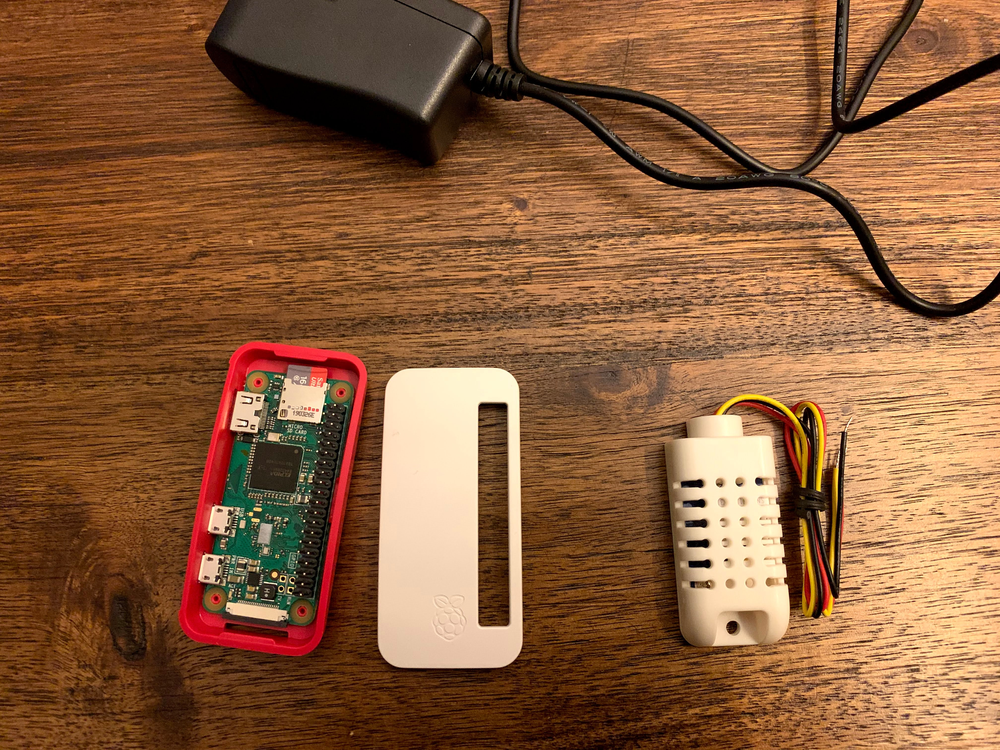

Winters in the midwest can be pretty dry, and I'm particularly susceptible to the dry air. In order to keep the humidity at the ideal level I went on the hunt for a humidity sensor. Then I thought to myself, "that's a bit too easy", and decided I could build my own.

| The Vision                    | The MVP                               |
|-------------------------------|---------------------------------------|
| Read temperature              | Read temperature                      |
| Read humidity                 | Read humidity                         |
| Report to "da cloud"          | Viewable on a website - local network |
| Viewable on a mobile app      |                                       |
| Viewable on a website - cloud |                                       |

## Tools
The raw materials we use to build our vision 🏗️



**Raspberry Pi Zero W**

https://www.adafruit.com/product/3708

**16 GB MicroSD Card**

https://amzn.to/2sE2PPz

**Raspbian Lite**

https://www.raspberrypi.org/downloads/raspbian/

**DHT22 Temperature and Humidity Sensor**

https://www.adafruit.com/product/393


## Installation
The Raspberry Pi Zero doesn't a full HDMI or USB-A port. This makes it slightly harder to just hook it up to a monitor and keyboard as I didn't have the adapters. Also, I'm a bit lazy. So I looked for an option that would allow me to preconfigure SSH and Wi-Fi so I could just connect to the Pi to continue the setup.

> I followed this [guide](https://desertbot.io/blog/headless-raspberry-pi-4-ssh-wifi-setup/)


**The highlights are below:**

Use Etcher to burn the image to the SD card https://www.balena.io/etcher/

Mount the SD card, and create an empty file called ssh in the `/boot` directory

*This tells the Pi to enable SSH on first boot*

Create a file call wpa_supplicant.config in the `/boot` directory

*On first boot the Pi will copy this file and use it to connect to the network*

Add the following information to the `wpa_supplicant.conf` file

```ini
country=US
ctrl_interface=DIR=/var/run/wpa_supplicant GROUP=netdev
update_config=1

network={
    ssid="NETWORK-NAME"
    psk="NETWORK-PASSWORD"
}
```

Eject the SD card, put it in the Pi, boot up, and SSH into it 😀

### Create a simple Python web service
Ultimately we will end up using Python to talk to the sensor, but that will come later. For now, we will just create a simple web service to prove out our setup. 

> I followed this [guide](https://medium.com/ymedialabs-innovation/deploy-flask-app-with-nginx-using-gunicorn-and-supervisor-d7a93aa07c18)

**I made a couple tweaks, so I'll summarize below**


| Libraries  |
|------------|
| Python 3   |
| Flask      |
| Nginx      |
| Gunicorn   |
| Supervisor |


### Create the App
SSH into the Pi and install some things to get us going 

`sudo apt-get install vim nginx supervisor python3 python3-venv`

Next, let's create a place to store our code 

`sudo mkdir -p /opt/myapp`

And move into that directory 

`cd /opt/myapp`

Create a virtualenv and activate it

`python3 -m venv envsource env/bin/activate`

Let's install some pip packages

`pip install Flask gunicorn`

Then create our app

```python
from flask import Flask

app = Flask(__name__)

@app.route('/')
def index():
    return "Hello World"

if __name__ == '__main__':
    app.run(port=8080)
```

### Install the App as a service
Next we're going to use Supervisor to run our app as a service

Edit the `/etc/supervisor/conf.d/supervisor.conf` file and add it this to the end

```ini
[program:myapp]
directory=/opt/myapp
command=/opt/myapp/env/bin/gunicorn app:app -b localhost:8080
autostart=true
autorestart=true
stderr_logfile=/var/log/myapp/myapp.err.log
stdout_logfile=/var/log/myapp/myapp.out.log
```


## ⏭️  In **__[Part 2](/posts/2020/th-iot-part-2)__** we will look at attaching the sensor and reading data