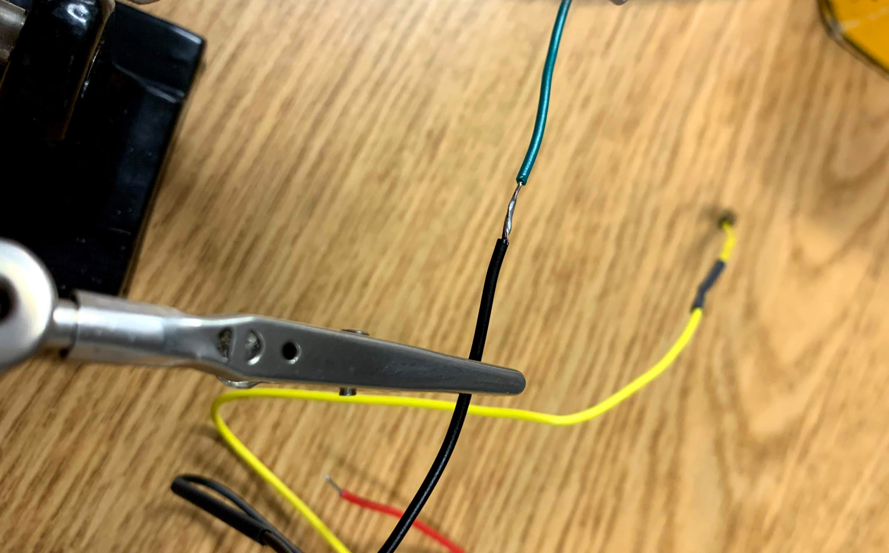
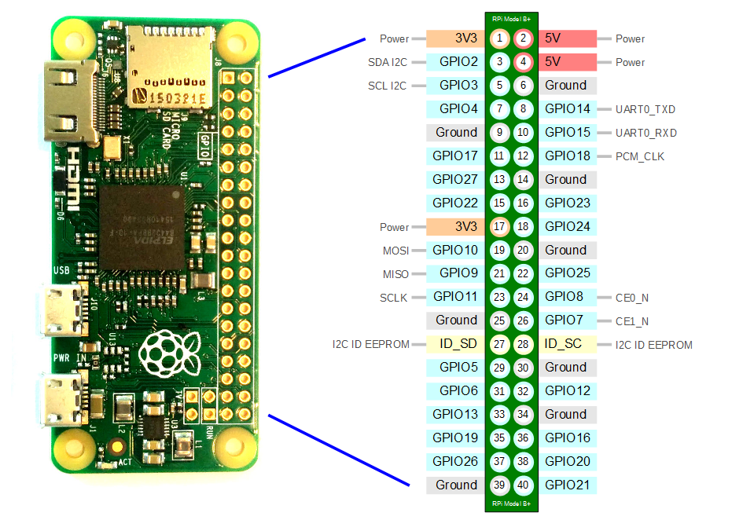

In the [part one](/posts/th-iot-part-1) we focused on getting the operating system installed and setting up our web service. In this part we will focus on attaching the sensor and reading data from it.

## Some Assembly Required
There are several ways you can attach the sensor (e.g: bread board, connector wires, solder directly to pinouts, etc). I chose to use connector wires so I could move things around easily if I needed to.

I started by stripping the connector wire, slipping on a piece of shrink tubing, then soldered the wire on the sensor to the connector wire. I'm by no means an expert at soldering, but one tip I would give is to be sure to tin the wires first.

You should end up with something like this:




Finally slide the shrink tubing over the soldered wire and use the edge of the soldering iron to shrink the tubing. A finished example can be seen on the yellow wire in the image above. (Note: the electrical tape was used to indicate wire color as I was limited in my supply of connector wires)

Next we need to attach the wires to the pin header on the Pi. In order to do this we need to know what the pins mean on the Pi, and what the colors mean on the wires. The colors can be found on the Adafruit website:

| Color  | Purpose    |
|--------|------------|
| Red    | 3.3V Power |
| Yellow | Data       |
| Black  | Ground     |

The Raspberry Pi pinout can be found online. The image below is the one I used




Next we connect up the three wires. The following table below shows what pin on the Raspberry Pi they connect to

| Color  | Pin # |
|--------|-------|
| Red    | 1     |
| Yellow | 7     |
| Black  | 6     |

The end result looks something like this:


## Let's read the data

First we're going to need to install some prerequisites like python3-dev and the Adafruit library to connect to the sensor.

`$ sudo apt-get install python3-dev`

Then from the python application directory

`$(.env) pip install Adafruit_DHT`

In order to read the data from the device we can write a simple Python application. Again another handy guide helped me on my way (https://pimylifeup.com/raspberry-pi-humidity-sensor-dht22/)


```python 
import Adafruit_DHT

DHT_SENSOR = Adafruit_DHT.DHT22
DHT_PIN = 4

while True:
    humidity, temperature = Adafruit_DHT.read_retry(DHT_SENSOR, DHT_PIN)
    tempF = (temperature * 1.8) + 32
    if humidity is not None and temperature is not None:
        print("Temp={0:0.1f}*F  Humidity={1:0.1f}%".format(tempF, humidity))
    else:
        print("Failed to retrieve data from humidity sensor")
```

*Note: The temperature that comes from the sensor is in Celsius*

*Tip: If you ran into a GPIO error (like I did) make sure the user running the application is part of the gpio group.*

Essentially the application above reads in an infinite loop the data from the sensor, formats it, and prints it out to the console.

The output should look something like this:
`Temp=64.5*F Humidity=37.2%`

## Integrating into our web service

Now that we are connected and reading data, let's add it to our Flask app. Just wrap the above code in a function and call it from the index method.

```python
from flask import Flask
from datetime import datetime
import Adafruit_DHT

DHT_SENSOR = Adafruit_DHT.DHT22
DHT_PIN = 4

app = Flask(__name__)

@app.route('/')
def index():
    res = getTempHumidity()
    return res

def convertCtoF(tempC):
    return (tempC * 1.8) + 32

def getTempHumidity():
    humidity, tempC = Adafruit_DHT.read_retry(DHT_SENSOR, DHT_PIN)

    if humidity is None and tempC is None:
        return "Failed to retrieve data from the sensor"

    tempF = convertCtoF(tempC)
    currentDateTime = datetime.now().strftime("%m/%d/%Y %H:%M:%S")
    degreeSymbol = u"\u00b0"

    return "[{0}] Temp={1:0.1f}{3}F  Humidity={2:0.1f}%".format(currentDateTime, tempF, humidity, degreeSymbol)


if __name__ == '__main__':
    app.run(host='0.0.0.0',port=5000,debug=True)
```


You will need to reload the supervisor app

`sudo supervisord reload myapp`

Then it should show up something like this when you view the web page:

`[01/04/2020 19:31:40] Temp=64.2°F Humidity=35.0%`

## ⏭️  In **__[Part 3](/posts/th-iot-part-3)__** we will go over sending the data to the cloud