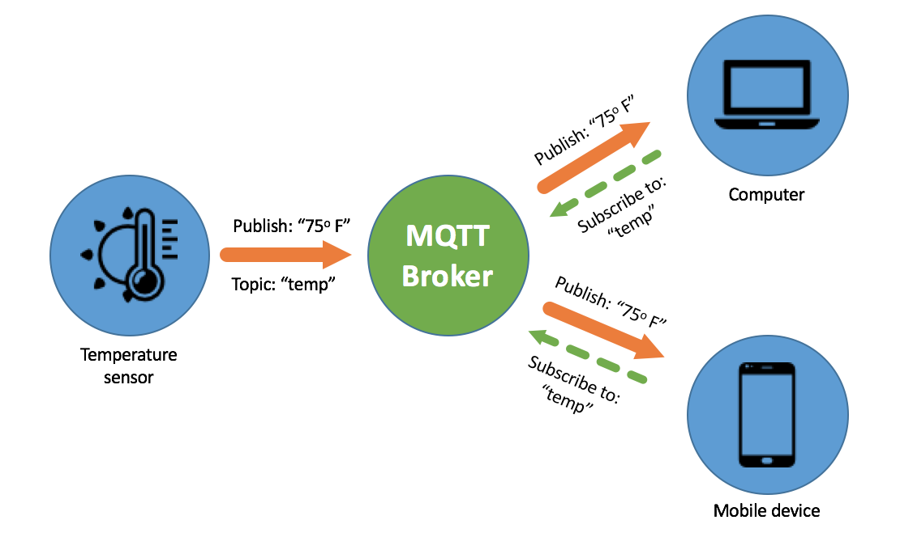
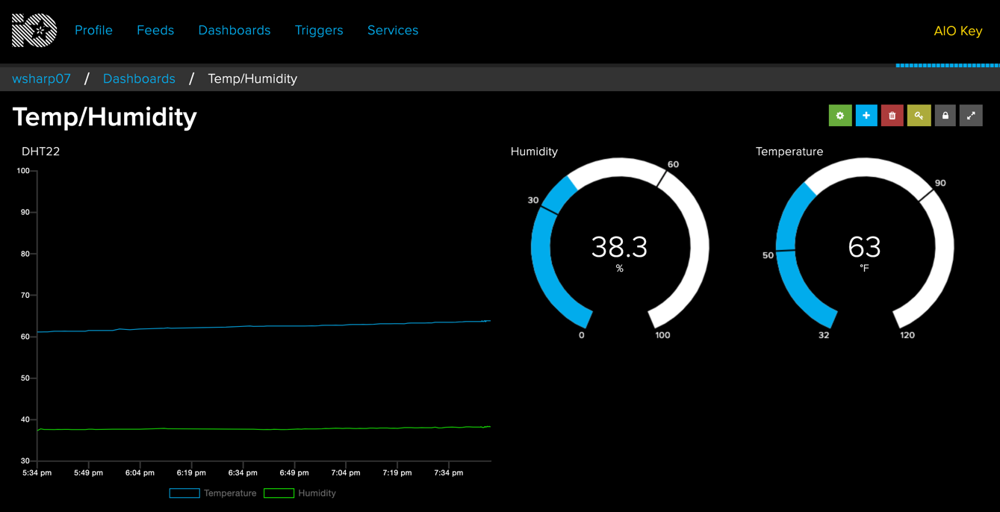

In the [part two](/posts/2020/th-iot-part-2) we assembled the hardware and were able to read data off of the DHT22 sensor. Then we took that data and displayed it on a web page.

During this part, we will go over how to send this data to the cloud and chart it. This way we can view trends and live information from the internet.

I was going to just document the successful outcome, but then I realized that would just cover up that sometimes we need to fail and pivot. In a separate post I'll list out my failed attempt to use AWS IoT. Let's get started!

## MQTT

Before we dive too far in we need to understand a buzz word. **MQTT** stands for Message Queuing Telemetry Transport. Put simply, it's a protocol for lightweight publish/subscribe messaging between machines in a low network speed (bandwidth) environment. 


<p class="subtext"> https://8bitwork.com/2019/04/13/messaging-protocol-for-iot-mqtt-coap-amqp-xmpp-and-dds-1/ </p>

## Selecting a platform

After some searching of platforms to host the data I settled on [Adafruit.IO](http://adafruit.io/). I've been pretty happy with Adafruit's documentation so far, so I thought that may be an indicator that their platform is easy to use. Turns out it is, so much in fact that they have a tutorial for exactly our project ( https://learn.adafruit.com/adafruit-io-basics-temperature-and-humidity ). There is a simple pub/sub script that you can [download](https://github.com/adafruit/Adafruit_IO_Python/blob/master/examples/mqtt/mqtt_groups_pubsub.py). Tweak the username and token and you're off to the races. It's really that easy.


## Creating the endpoints

In the Adafruit platform we need to create an area we can report the data to. There are two pieces to that: "feeds" and "groups". These may be referred to as "topics" in MQTT world. The walkthrough can be found here: https://learn.adafruit.com/adafruit-io-basics-feeds

We will create a group:
* `dht22`

Then create two feeds. You need a feed for each data point you want to report on.
* `temperature`
* `humidity`

## Create an app to report the data

Now that the demo is running let's take what we learned in Part 2 and create a daemon to report the data. We'll take the pub/sub example above and modify it for our needs. 

Let's first address the private information: `IO_KEY` and `IO_USERNAME`

```ini
# Set to your Adafruit IO key.
# Remember, your key is a secret,
# so make sure not to publish it when you publish this code!
ADAFRUIT_IO_KEY = 'YOUR_AIO_KEY'

# Set to your Adafruit IO username.
# (go to https://accounts.adafruit.com to find your username)
ADAFRUIT_IO_USERNAME = 'YOUR_AIO_USERNAME'
```

The comments call out quite appropriately that you shouldn't publish this information. Instead of storing it in code where it could be accidentally published, let's use `python-dotenv` instead.

First we will install it
`pip install python-dotenv`

Create a file `.env` and put in the following data
```ini
IO_USERNAME="myusername"
IO_KEY="myadafruitiotoken"
```

Then we will modify the code to be this instead
```python
from dotenv import load_dotenv

load_dotenv()

ADAFRUIT_IO_KEY = os.getenv("IO_KEY")
ADAFRUIT_IO_USERNAME = os.getenv("IO_USERNAME")
```

Let's take a look at the `while` loop that needs to be tweaked to report our data

```python
while True:
    humidity, temperature = Adafruit_DHT.read_retry(DHT_SENSOR, DHT_PIN)
    tempF = (temperature * 1.8) + 32
    if humidity is not None and temperature is not None:
        print("Temp={0:0.1f}*F  Humidity={1:0.1f}%".format(tempF, humidity))
        client.publish('temperature', tempF, GROUP_NAME)
        client.publish('humidity', humidity, GROUP_NAME)
    else:
        print("Failed to retrieve data from humidity sensor")

    time.sleep(5)
```

We cannibalized the code that was in the sample, tossed in some familiar code from Part 2, and added a couple lines to publish the data. Let's look closer at that.

```python
client.publish('temperature', tempF, GROUP_NAME)
client.publish('humidity', humidity, GROUP_NAME)
```

This code publishes the data to Adafruit IO. There are three arguments. The first is the feed name, next is the data, and finally is the group name.

When you put it all together you end up with something like this:

```python
from Adafruit_IO import MQTTClient
from dotenv import load_dotenv
import Adafruit_DHT
import sys
import time
import os

load_dotenv()

ADAFRUIT_IO_KEY = os.getenv("IO_KEY")
ADAFRUIT_IO_USERNAME = os.getenv("IO_USERNAME")

DHT_SENSOR = Adafruit_DHT.DHT22
DHT_PIN = 4

GROUP_NAME = 'dht22'

# Define callback functions which will be called when certain events happen.
def connected(client):
    print('Listening for changes on ', GROUP_NAME)
    client.subscribe_group(GROUP_NAME)

def disconnected(client):
    print('Disconnected from Adafruit IO!')
    sys.exit(1)

def message(client, topic_id, payload):
    print('Topic {0} received new value: {1}'.format(topic_id, payload))


# Create an MQTT client instance.
client = MQTTClient(ADAFRUIT_IO_USERNAME, ADAFRUIT_IO_KEY)

# Setup the callback functions defined above.
client.on_connect    = connected
client.on_disconnect = disconnected
client.on_message    = message

client.connect()
client.loop_background()

print('Publishing a new message every 5 seconds')
while True:
    humidity, temperature = Adafruit_DHT.read_retry(DHT_SENSOR, DHT_PIN)
    tempF = (temperature * 1.8) + 32
    if humidity is not None and temperature is not None:
        print("Temp={0:0.1f}*F  Humidity={1:0.1f}%".format(tempF, humidity))
        client.publish('temperature', tempF, GROUP_NAME)
        client.publish('humidity', humidity, GROUP_NAME)
    else:
        print("Failed to retrieve data from humidity sensor")

    time.sleep(5)
```

When you fire it up then you should start seeing data in Adafruit IO. You'll need to create a dashboard to start looking at the data. Here is a nice walkthrough for that: https://learn.adafruit.com/adafruit-io-basics-dashboards

When you finish setting it up you should end up with something like the image below.



## Let's make a daemon

Unless we want to login and run this app manually every time we plug in the Pi we will need to create a daemon. This is service which runs the app in the background for us automatically. In Part 1 we looked at Supervisor. We will continue to use that here, but just tweak it a bit.

```ini
[program:myapp]
directory=/opt/myapp
command=/opt/myapp/env/bin/python app.py
autostart=true
autorestart=true
stderr_logfile=/var/log/myapp/myapp.err.log
stdout_logfile=/var/log/myapp/myapp.out.log
```

Instead of running Gunicorn and Flask we will just run our file. This will report the data continuously to the Adafruit platform. 

That's it we've successfully setup our app.

## ⏭️  In **__[Part 4](/posts/2020/th-iot-part-4)__** we will look at using the Adafruit IO API to create a mobile app