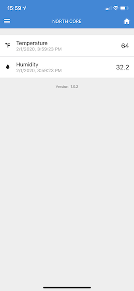

In the [part three](/posts/2020/th-iot-part-3) we set up a daemon to send data to Adafruit IO. This gave us a slick dashboard to view live and historical data.

In this part, we will go through setting up a mobile app to give us a quick way to look at the live data on the go. Someone was telling me how easy React Native was to get up and running with, so I decided to give it a shot.

## Getting Started

Getting started with React Native is pretty straight forward. Just install Expo and create a new app. You can find the walkthrough [here](https://facebook.github.io/react-native/docs/getting-started). 

Expo is a cool piece of technology. Installing it on your smartphone gives you an easy way to live reload your app during development. You can also publish to Expo so that your app is available outside of the local network. 

Next, we'll follow [this](https://facebook.github.io/react-native/docs/tutorial) tutorial and create a simple "Hello World" app to prove everything is set up correctly. A snippet of the code can be found below.

<div data-snack-id="SyNkhoNf8" data-snack-platform="web" data-snack-preview="true" data-snack-theme="light" style="overflow:hidden;background:#fafafa;border:1px solid rgba(0,0,0,.08);border-radius:4px;height:505px;width:100%"></div>
<script async src="https://snack.expo.io/embed.js"></script>

## Choosing a UI Framework

The next thing we'll do is choose a UI framework. This will allow us to get a more native look and feel. Searching around I found several out there but decided to go with a popular one [React Native Elements](https://react-native-elements.github.io/react-native-elements/)


## Creating a Layout

Now that we have a basic app and a UI framework, let's create a skeleton of what we want our app to look like. I chose to keep it simple and just have a header and a few list items for Temperature and Humidity.

**App.tsx**

This is just our basic layout for the app. We will import `Header` and `Divider` from the `react-native-elements` library. Then also link our `Temperature` file so we can include that component.

```jsx
import React from 'react';
import { View, StyleSheet } from 'react-native';
import { Header, Divider } from 'react-native-elements';
import Temperature from './components/temperature/Temperature';

export default function App() {
  return (
    <View style={styles.container}>
      <Header
        leftComponent={{ icon: 'menu', color: '#fff' }}
        centerComponent={{ text: 'NORTH CORE', style: { color: '#fff' } }}
        rightComponent={{ icon: 'home', color: '#fff' }}
      />
      <Divider style={styles.divider} />
      <Temperature></Temperature>
      <Divider style={styles.divider} />
    </View>
  );
}

const styles = StyleSheet.create({
  container: {
    flex: 1,
    backgroundColor: '#eee'
  },
  divider: {
    backgroundColor: '#eee',
    height: 20
  }
});
```

**Temperature.tsx**

This is more of the meat of the app. Enclosed in our `View` are two `ListItem` from the `react-native-elements` library. These will display our Temp and Humidity. 
```jsx
import React from 'react';
import { View } from 'react-native';
import { ListItem } from 'react-native-elements';

export default class Temperature extends React.Component {
  
  constructor(props) {
    super(props);
  }

  render() {
    return (
      <View>      
        <ListItem key="1" title="Temp" bottomDivider />
        <ListItem key="2" title="Humidity" bottomDivider />
      </View>

    );
  }
}
```

You should end up with something that looks similar to below


## Sprucing it up a bit

This is a good start but let's spruce it up a bit. 

First, let's add some icons to the list items and some mocked values on the right side

```jsx
import { View, Text } from 'react-native';
import Icon from 'react-native-vector-icons/MaterialCommunityIcons'; 

...

return (
      <View>      
        <ListItem 
            key="1" 
            title="Temp" 
            leftIcon={<Icon name="temperature-fahrenheit"></Icon>}
            rightIcon={<Text>64</Text>}
            bottomDivider />
        <ListItem 
            key="2" 
            title="Humidity" 
            leftIcon={<Icon name="water"></Icon>}
            rightIcon={<Text>34.2</Text>}
            bottomDivider />
      </View>

    );
```

Next, let's add a bit of styling to make the icon and values more readable. I found the way React (or React Native) handles stylesheets to be interesting. You're scoping the style to the component. Add the following code to the bottom of the `Temperature.tsx` file.

```jsx
const styles = StyleSheet.create({
  container: {
    flex: 1,
    padding: 20
  },
  subtitle: {
    color: '#999'
  },
  icon: {
    fontSize: 20,
  },
});
```

And then we need to make a few minor changes to the `ListItem` to make sure it uses the new stylesheet.

```jsx
<ListItem 
    key="1" 
    title="Temp" 
    leftIcon={<Icon style={styles.icon} name="temperature-fahrenheit"></Icon>}
    rightIcon={<Text style={styles.icon}>64</Text>}
    bottomDivider />
```


## Storing the State

Another component that we will need is the ability to store the state, such as the values returned from Adafruit IO. Since we are using TypeScript we will create an interface and update the component signature. Also we will create an interface to store the response from the data request.

```typescript
export interface State  {
  isLoading: boolean,
  temperature: AIOResponse,
  humidity: AIOResponse
}

export interface AIOResponse {
  id: number,
  title: string,
  icon: string,
  value: number,
  updatedAt: string
}
```

```typescript
export default class Temperature extends React.Component<{}, State> {
```

Then let's update the constructor to initialize the state with some sensible defaults

```typescript
constructor(props) {
  super(props);
  this.state = { 
    isLoading: true, 
    temperature: {} as AIOResponse,
    humidity: {} as AIOResponse
  }
}
```

## Getting the data

Now that we have a good looking layout we need to take a look at how we'll get the data.

First let's define some variables we will need. `AIO_KEY` and `USERNAME` will need to be replaced with your values.

```javascript
headers = {
  'X-AIO-Key': AIO_KEY,
  'Content-Type': 'application/json'
};
tempUrl = `https://io.adafruit.com/api/v2/${USERNAME}/feeds/northcore.temperature/data/last`
humidityUrl = `https://io.adafruit.com/api/v2/${USERNAME}/feeds/northcore.humidity/data/last`
```

Next, we will leverage an event in ReactJS called `componentDidMount`. This is called immediately after a component is mounted. 

```jsx
async componentDidMount() {
    this.getData();
}
```

Next, let's flesh out `getData`. We'll lean heavily on the `fetch` API.

```jsx
getData = () => {

  let temp = fetch(this.tempUrl, {
    headers: this.headers
  })
  .then((res) => res.json())
  .then((resJson) => {
    this.setState({
      temperature: {
        id: 1,
        title: 'Temperature',
        icon: 'temperature-fahrenheit',
        value: this.formatValue(resJson.value),
        updatedAt: this.formatDate(resJson.updated_at)
      }
    })
  })

  let humidity = fetch(this.humidityUrl, {
    headers: this.headers
  })
  .then((res) => res.json())
  .then((resJson) => {
    this.setState({
      humidity: {
        id: 2,
        title: 'Humidity',
        icon: 'water',
        value: this.formatValue(resJson.value),
        updatedAt: this.formatDate(resJson.updated_at)
      }
    })
  })

  return Promise.all([temp, humidity])
    .then((res) => {
      this.setState({
        isLoading: false,
      }, function(){

      });
    });
}
```

This is a lot of text, but there isn't very much going on. Let's break it down.

First, we fetch the data from the appropriate URL we defined above. We pass in the headers with our authentication tokens.

```jsx
let humidity = fetch(this.humidityUrl, {
    headers: this.headers
  })
```

Next, we pipe that data we get back and convert it to JSON. Then we pipe that JSON to a function that sets updates the application state with the response from the API.

```jsx
.then((res) => res.json())
  .then((resJson) => {
    this.setState({
      humidity: {
        id: 2,
        title: 'Humidity',
        icon: 'water',
        value: this.formatValue(resJson.value),
        updatedAt: this.formatDate(resJson.updated_at)
      }
    })
  })
```

Lastly, we wait on all of our API calls to complete as we want to upgrade the screen at the same time.

```jsx
return Promise.all([temp, humidity])
    .then((res) => {
      this.setState({
        isLoading: false,
      }, function(){

      });
    });
```

## The finished product

You can view the full code [here](https://github.com/wsharp07/northcore-mobile)

